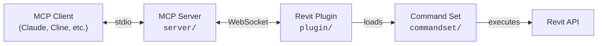

[](https://github.com/mcp-servers-for-revit/mcp-servers-for-revit)

# mcp-servers-for-revit

**Connect AI assistants to Autodesk Revit via the Model Context Protocol.**

mcp-servers-for-revit enables AI clients like Claude, Cline, and other MCP-compatible tools to read, create, modify, and delete elements in Revit projects. It consists of three components: a TypeScript MCP server that exposes tools to AI, a C# Revit add-in that bridges commands into Revit, and a command set that implements the actual Revit API operations.

> [!NOTE]
> This is a fork of the original [revit-mcp](https://github.com/mcp-servers-for-revit/revit-mcp) project with additional tools and functionality improvements.

## Architecture



The **MCP Server** (TypeScript) translates tool calls from AI clients into WebSocket messages. The **Revit Plugin** (C#) runs inside Revit, listens for those messages, and dispatches them to the **Command Set** (C#), which executes the actual Revit API operations and returns results back up the chain.

## Requirements

- **Node.js 18+** (for the MCP server)
- **Autodesk Revit 2020 - 2026** (any supported version)

## Quick Start (Using a Release)

1. Download the ZIP for your Revit version from the [Releases](https://github.com/mcp-servers-for-revit/mcp-servers-for-revit/releases) page (e.g., `mcp-servers-for-revit-v1.0.0-Revit2025.zip`)

2. Extract the ZIP and copy the contents to your Revit addins folder:
   ```
   %AppData%\Autodesk\Revit\Addins\<your Revit version>\
   ```
   After copying you should have:
   ```
   Addins/2025/
   ├── mcp-servers-for-revit.addin
   └── revit_mcp_plugin/
       ├── RevitMCPPlugin.dll
       ├── ...
       └── Commands/
           └── RevitMCPCommandSet/
               ├── command.json
               └── 2025/
                   ├── RevitMCPCommandSet.dll
                   └── ...
   ```

3. Configure the MCP server in your AI client (see [MCP Server Setup](#mcp-server-setup))

4. Start Revit — if prompted about an unknown add-in, click **Always Load**

5. In Revit, click the **Settings** button on the mcp-servers-for-revit ribbon tab, enable the commands you want to use, and click **Save**

## MCP Server Setup

The MCP server is published as an npm package and can be run directly with `npx`.

**Claude Code**

Run this in a **terminal** (not inside Claude Code):

```bash
claude mcp add mcp-server-for-revit -- cmd /c npx -y mcp-server-for-revit
```

**Claude Desktop**

Claude Desktop → Settings → Developer → Edit Config → `claude_desktop_config.json`:

```json
{
    "mcpServers": {
        "mcp-server-for-revit": {
            "command": "cmd",
            "args": ["/c", "npx", "-y", "mcp-server-for-revit"]
        }
    }
}
```

Restart Claude Desktop. When you see the hammer icon, the MCP server is connected.


## Revit Plugin Setup

If using a release ZIP, the plugin is already included. For manual installation:

1. Build the plugin from `plugin/` (see [Development](#development))
2. Copy `mcp-servers-for-revit.addin` to `%AppData%\Autodesk\Revit\Addins\<version>\`
3. Copy the `revit_mcp_plugin/` folder to the same addins directory

## Command Set Setup

If using a release ZIP, the command set is pre-installed inside the plugin. For manual installation:

1. Build the command set from `commandset/` (see [Development](#development))
2. Inside the plugin's installation directory, create `Commands/RevitMCPCommandSet/<year>/`
3. Copy the built DLLs into that folder
4. Copy `command.json` (from repo root) into `Commands/RevitMCPCommandSet/`

## Tool Catalogs

To keep the MCP client's context window small, the server exposes tools in two layers:

- **Layer 1 (always loaded):** the `core` catalog plus three meta tools, about 3k tokens in total.
  - `search_tools` finds tools by keyword or catalog.
  - `enable_catalog` loads a catalog's tools as native tools.
  - `call_tool` runs a **read-only** catalog tool without loading it.
- **Layer 2 (on demand):** catalogs modelled on the Revit ribbon tabs:

| Catalog | Aliases | Contents |
| ------- | ------- | -------- |
| `architecture` | `arch` | Walls, doors, windows, floors, roofs, rooms, levels, grids |
| `structure` | `struct`, `register` | Framing systems, register extraction (grid, column/wall, beam), shared modelling tools |
| `annotate` | `drafting` | Dimensions, tags, text, detail lines, regions, components, clouds, spot elevations, rebar annotation |
| `views` | `sheets`, `schedule` | Views, sheets, viewports, schedules, templates, filters, overrides, revisions, export |
| `modify` | `edit` | Select, hide, recolor, transparency, delete |
| `analyze` | `analysis` | Model statistics, material quantities, room data export |
| `data` | `database` | Local SQLite project and room storage |
| `automation` | `code` | Run C# code inside Revit |

Tools that modify the model can only be called after their catalog is enabled, so the client's per-tool permission prompts still apply.

Configure the behaviour with environment variables on the MCP server:

| Variable | Values | Default |
| -------- | ------ | ------- |
| `REVIT_MCP_TOOL_MODE` | `dynamic` (layered) or `all` (expose every tool up front) | `dynamic` |
| `REVIT_MCP_CATALOGS` | Comma-separated catalogs to load at startup, e.g. `structure,drafting` | *(none)* |

`dynamic` mode relies on the client refreshing its tool list when it receives `notifications/tools/list_changed`. If your client does not, read-only tools still work through `call_tool`. For tools that modify the model, set `REVIT_MCP_TOOL_MODE=all` or preload their catalogs with `REVIT_MCP_CATALOGS`.

## Supported Tools

| Tool | Catalog | Description |
| ---- | ------- | ----------- |
| `get_current_view_info` | core | Get current active view info |
| `get_current_view_elements` | core | Get elements from the current active view |
| `get_available_family_types` | core | Get available family types in current project |
| `get_selected_elements` | core | Get currently selected elements |
| `get_material_quantities` | analyze | Calculate material quantities and takeoffs |
| `ai_element_filter` | core | Intelligent element querying tool for AI assistants |
| `analyze_model_statistics` | analyze | Analyze model complexity with element counts |
| `create_point_based_element` | architecture, structure | Create point-based elements (door, window, furniture) |
| `create_line_based_element` | architecture, structure | Create line-based elements (wall, beam, pipe) |
| `create_surface_based_element` | architecture, structure | Create surface-based elements (floor, ceiling, roof) |
| `create_grid` | architecture, structure | Create a grid system with smart spacing generation |
| `create_level` | architecture, structure | Create levels at specified elevations |
| `create_room` | architecture | Create and place rooms at specified locations |
| `create_dimensions` | annotate | Create dimension annotations in the current view |
| `create_structural_framing_system` | structure | Create a structural beam framing system |
| `delete_element` | modify | Delete elements by ID |
| `operate_element` | modify | Operate on elements (select, setColor, hide, etc.) |
| `color_elements` | modify | Color elements based on a parameter value |
| `tag_all_walls` | annotate | Tag all walls in the current view |
| `tag_all_rooms` | annotate | Tag all rooms in the current view |
| `tag_elements` | annotate | Tag elements of any category in a view (by id or category, skipping already-tagged) |
| `create_text_note` | annotate | Create text notes in a view or on a sheet |
| `create_detail_lines` | annotate | Create detail lines and arcs with a line style |
| `create_filled_region` | annotate | Create filled or masking regions from boundary loops |
| `place_detail_component` | annotate | Place point- or line-based detail components |
| `create_revision_cloud` | annotate | Create revision clouds around rectangles or polygons |
| `create_grid_dimensions` | annotate, structure | Create grid chain and overall dimensions in a view |
| `create_spot_elevations` | annotate, structure | Create spot elevations and spot coordinates on elements |
| `find_tag_overlaps` | annotate | Report overlapping tags and annotations in a view |
| `delete_orphaned_tags` | annotate | Delete tags that no longer reference an element |
| `create_rebar_annotation` | annotate, structure | Create multi-rebar annotations and rebar tags |
| `list_views` | views | List views, templates and view family types with their sheet placements |
| `list_sheets` | views | List sheets with title blocks, viewports and schedules, plus title block types |
| `create_view` | views | Create plans, sections, elevations, 3D and drafting views |
| `duplicate_view` | views | Duplicate views (copy, with detailing, or dependent) |
| `create_sheet` | views | Create sheets with title block, number, name, parameters and revisions |
| `place_viewport` | views | Place views and schedules on sheets |
| `create_schedule` | views, analyze | Create schedules with fields, filters and sorting/grouping |
| `get_schedule_data` | views, analyze | Read schedule rows, or list schedules |
| `apply_view_template` | views | Apply or remove view templates on views |
| `create_view_filter` | views | Create parameter filters and add them to views with overrides |
| `override_graphics` | views, modify | Override graphics of elements or categories in a view |
| `export_sheets` | views | Export sheets or views to PDF or DWG |
| `export_view_image` | views | Export views to image files |
| `list_revisions` | views | List revisions and the sheets they appear on |
| `create_revision` | views | Create revisions |
| `update_sheets` | views | Rename, renumber and set parameters or revisions on sheets |
| `create_callout` | views | Create callout views |
| `set_crop_region` | views | Set or fit the crop region of views |
| `set_view_range` | views | Set the view range of plan views |
| `align_viewports` | views | Align viewports across sheets |
| `export_room_data` | analyze, architecture | Export all room data from the project |
| `get_grid_register_data` | structure | Return register-ready grid data (one record per grid, axis family and coordinate in mm) |
| `get_column_wall_register_data` | structure | Return register-ready column and wall data (one record per physical column or wall leg in mm) |
| `get_beam_register_data` | structure | Return register-ready beam data with start/end supports and face-to-face clear span (mm) |
| `store_project_data` | data | Store project metadata in local database |
| `store_room_data` | data | Store room metadata in local database |
| `query_stored_data` | data | Query stored project and room data |
| `send_code_to_revit` | automation | Send C# code to Revit to execute |
| `say_hello` | core | Display a greeting dialog in Revit (connection test) |

## Testing

The test project uses [Nice3point.TUnit.Revit](https://github.com/Nice3point/RevitUnit) to run integration tests against a live Revit instance. No separate addin installation is required — the framework injects into the running Revit process automatically.

### Prerequisites

- **.NET 10 SDK** — required by Nice3point.Revit.Sdk 6.1.0. Install via `winget install Microsoft.DotNet.SDK.10`
- **Autodesk Revit 2026** (or 2025) — must be installed and licensed on your machine

> The repository includes a Revit-independent test project at `tests/RegisterGeometry.Tests` (target `net8.0`) that runs from the .NET 9 SDK installed with the command set. Run it with `dotnet test tests/RegisterGeometry.Tests -c Debug`. The TUnit live tests under `tests/commandset` still require the .NET 10 SDK and a running Revit host.

### Running Tests

1. Open Revit 2026 (or 2025) and wait for it to fully load
2. Run the tests from the command line:

```bash
# For Revit 2026
dotnet test -c Debug.R26 -r win-x64 tests/commandset

# For Revit 2025
dotnet test -c Debug.R25 -r win-x64 tests/commandset
```

> **Note:** The `-r win-x64` flag is required on ARM64 machines because the Revit API assemblies are x64-only.

Alternatively, you can use `dotnet run`:

```bash
cd tests/commandset
dotnet run -c Debug.R26
```

### IDE Support

- **JetBrains Rider** — enable "Testing Platform support" in Settings > Build, Execution, Deployment > Unit Testing > Testing Platform
- **Visual Studio** — tests should be discoverable through the standard Test Explorer

### Test Structure

| Directory | Purpose |
|-----------|---------|
| `tests/commandset/AssemblyInfo.cs` | Global `[assembly: TestExecutor<RevitThreadExecutor>]` registration |
| `tests/commandset/Architecture/` | Tests for level and room creation commands |
| `tests/commandset/DataExtraction/` | Tests for model statistics, room data export, and material quantities |
| `tests/commandset/ColorSplashTests.cs` | Tests for color override functionality |
| `tests/commandset/TagRoomsTests.cs` | Tests for room tagging functionality |

### Writing New Tests

Test classes inherit from `RevitApiTest` and use TUnit's async assertion API:

```csharp
public class MyTests : RevitApiTest
{
    private static Document _doc;

    [Before(HookType.Class)]
    [HookExecutor<RevitThreadExecutor>]
    public static void Setup()
    {
        _doc = Application.NewProjectDocument(UnitSystem.Imperial);
    }

    [After(HookType.Class)]
    [HookExecutor<RevitThreadExecutor>]
    public static void Cleanup()
    {
        _doc?.Close(false);
    }

    [Test]
    public async Task MyTest_Condition_ExpectedResult()
    {
        var elements = new FilteredElementCollector(_doc)
            .WhereElementIsNotElementType()
            .ToElements();

        await Assert.That(elements.Count).IsGreaterThan(0);
    }
}
```

## Development

### MCP Server

```bash
cd server
npm install
npm run build
```

The server compiles TypeScript to `server/build/`. During development you can run it directly with `npx tsx server/src/index.ts`.

### Revit Plugin + Command Set

Open `mcp-servers-for-revit.sln` in Visual Studio. The solution contains both the plugin and command set projects. Build configurations target Revit 2020-2026:

- **Revit 2020-2024**: .NET Framework 4.8 (`Release R20` through `Release R24`)
- **Revit 2025-2026**: .NET 8 (`Release R25`, `Release R26`)

Building the solution automatically assembles the complete deployable layout in `plugin/bin/AddIn <year> <config>/` - the command set is copied into the plugin's `Commands/` folder as part of the build.

## Project Structure

```
mcp-servers-for-revit/
├── mcp-servers-for-revit.sln    # Combined solution (plugin + commandset + tests)
├── command.json     # Command set manifest
├── server/          # MCP server (TypeScript) - tools exposed to AI clients
├── plugin/          # Revit add-in (C#) - WebSocket bridge inside Revit
├── commandset/      # Command implementations (C#) - Revit API operations
├── tests/           # Integration tests (C#) - TUnit tests against live Revit
├── assets/          # Images for documentation
├── .github/         # CI/CD workflows, contributing guide, code of conduct
├── LICENSE
└── README.md
```

## Releasing

A single `v*` tag drives the entire release. The [release workflow](.github/workflows/release.yml) automatically:

- Builds the Revit plugin + command set for Revit 2020-2026
- Creates a GitHub release with `mcp-servers-for-revit-vX.Y.Z-Revit<year>.zip` assets
- Publishes the MCP server to npm as [`mcp-server-for-revit`](https://www.npmjs.com/package/mcp-server-for-revit)

To create a release:

1. Run the bump script (updates `server/package.json`, `server/package-lock.json`, and `plugin/Properties/AssemblyInfo.cs`, then commits and tags):
   ```powershell
   ./scripts/release.ps1 -Version X.Y.Z
   ```

2. Push to trigger the workflow:
   ```bash
   git push origin main --tags
   ```

> [!NOTE]
> npm publish uses [trusted publishing](https://docs.npmjs.com/trusted-publishers/) via OIDC — no npm token is required. Provenance attestation is generated automatically.

## Acknowledgements

This project is a fork of the work by the [mcp-servers-for-revit](https://github.com/mcp-servers-for-revit) team. The original repositories:

- [revit-mcp](https://github.com/mcp-servers-for-revit/revit-mcp) - MCP server
- [revit-mcp-plugin](https://github.com/mcp-servers-for-revit/revit-mcp-plugin) - Revit plugin
- [revit-mcp-commandset](https://github.com/mcp-servers-for-revit/revit-mcp-commandset) - Command set

Thank you to the original authors for creating the foundation that this project builds upon.

## License

[MIT](LICENSE)
